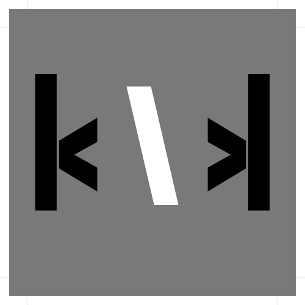
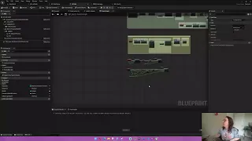
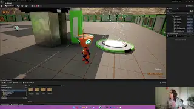
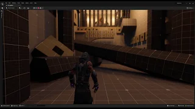
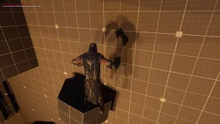
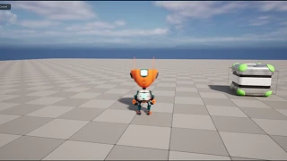

<h> <link rel="stylesheet" href="devicon.min.css"> </h>

  

  
  

 *R1, R2, L1, X, LEFT, DOWN, RIGHT, UP, LEFT, DOWN, RIGHT, UP*

---

 
# 👩‍💻 About Me:

|👨‍👩‍👧 Mother & Wife | 🎓 Full Sail University Game Design Student - Graduating 2024 | 🎮 Video Game Enthusiast|
|:---:|:---:|:---:|

---

## Here's some stuff I'm good at:

## Game Design Samples:

### Jetpack Jump Puzzle Mini-Game

| | |
|:---:|:---:|
|Technical Walkthrough|Gameplay Walkthrough|

### Greyboxing Adventure Level

| | |
|:---:|:---:|
|First Iteration|Second Iteration|

||
|:---:|
|Magnetic Box Toy|
---
# My Holopins!

  

