<h> <link rel="stylesheet" href="devicon.min.css"> </h>

 
# 👩‍💻 Hello, I'm Kayleen! Here's a little about me:

|👨‍👩‍👧 Mother & Wife | 🎓 Game Design Student | 🎮 Video Game Enthusiast |
|:---:|:---:|:---:|

  
  

 *R1, R2, L1, X, LEFT, DOWN, RIGHT, UP, LEFT, DOWN, RIGHT, UP*

---

## Here's some stuff I'm good at:

---
 

## Game Design Samples:

### Prototype Mechanics
|[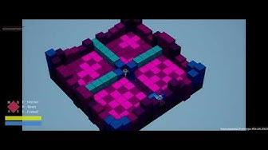](https://youtu.be/ljpsaDAmavs?si=2MM3SkN_BIj4IQq9) | [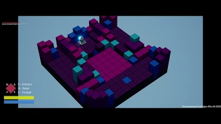](https://youtu.be/oYKp6RNtynw?si=cBR2EU83IafWene1) | [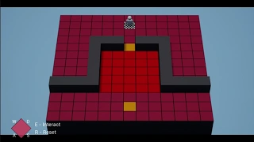](https://youtu.be/WmBLcvHgDxQ?si=dw3jFqMnaENMJ4gN)
|:---:|:---:|:---:|
|Tile Game|Tile Game Implementation|Lights Out Logic Game|

|[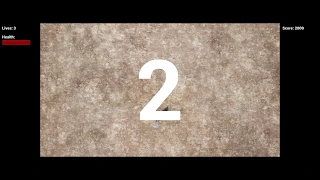](https://youtu.be/jKaDobI_qco?si=qwyjOrRA_UDBgdLU)
|:---:|
|Top Down Shooter|

|[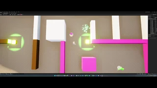](https://youtu.be/NsqgasrSQ9s?si=IXDKEI1zmHlMMPrG)
|:---:|
|AI Prototype|

|[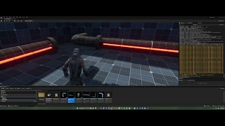](https://youtu.be/d4GQv-Ub_oA) | [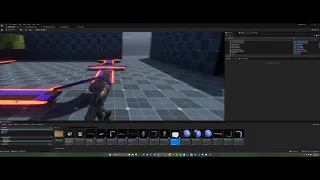](https://youtu.be/JmMs9r4eBZc?si=GNWz86eHrZWQeuf1)|
|:---:|:---:|
|Pipe Rotating Puzzle|Conveyor Belt System|

### Alpha/Greyboxing Level

| | |
|:---:|:---:|
|First Iteration|Second Iteration|

 ### Beta Level
 
|[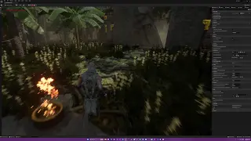](https://youtu.be/X-aGR45x_7w)
|:---:|
|Environment Design Beta|
 
# Level Design Process
 
## Before & After
 
|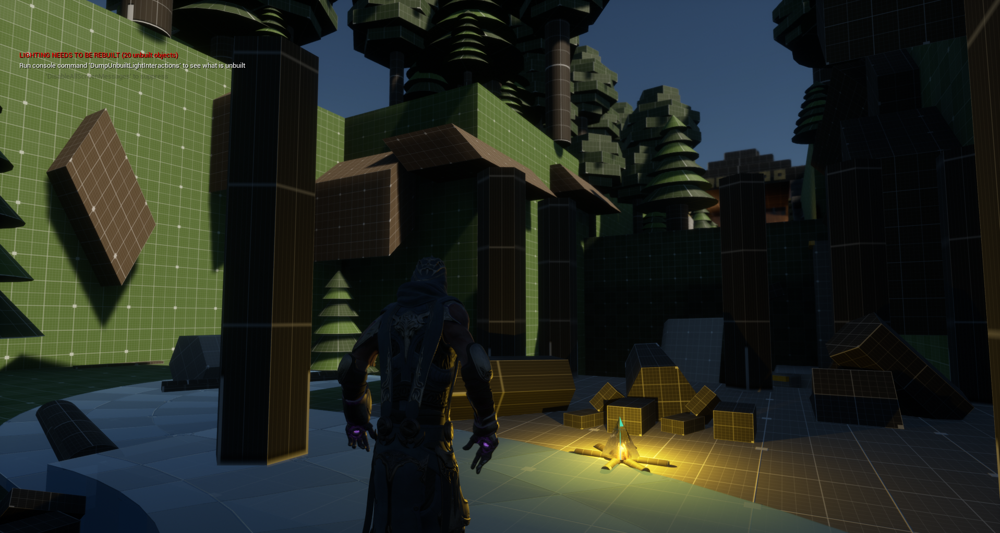 | 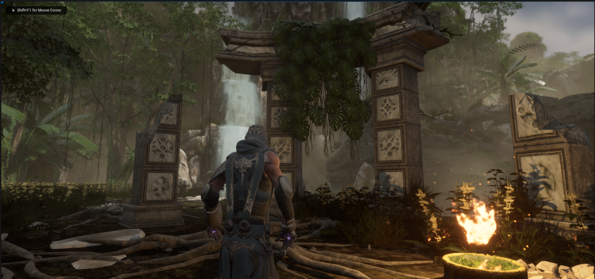|
|:---:|:---:|

|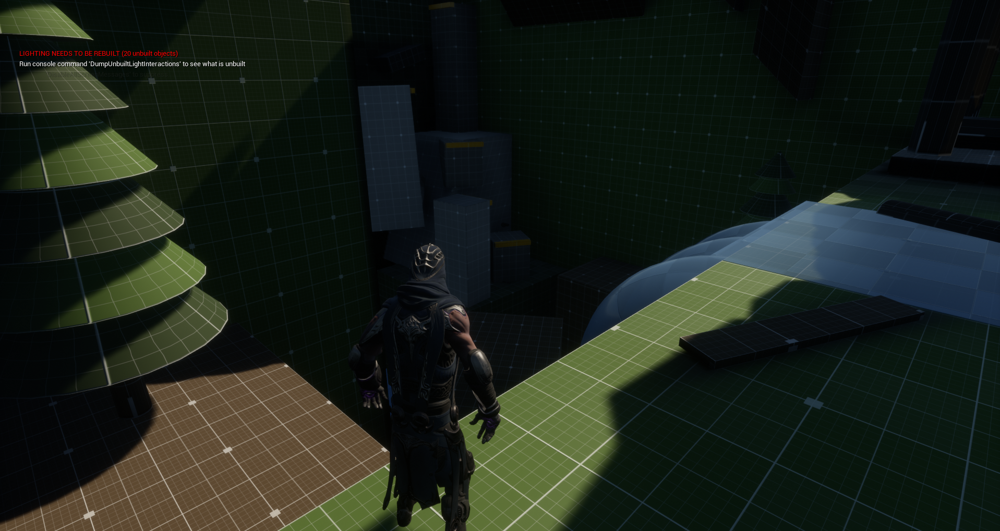 | |
|:---:|:---:|

|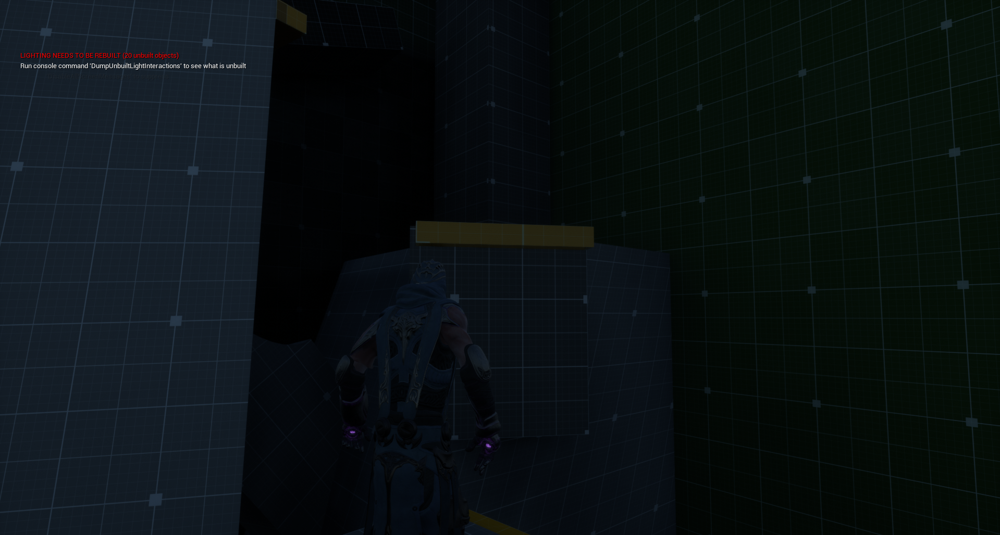 | 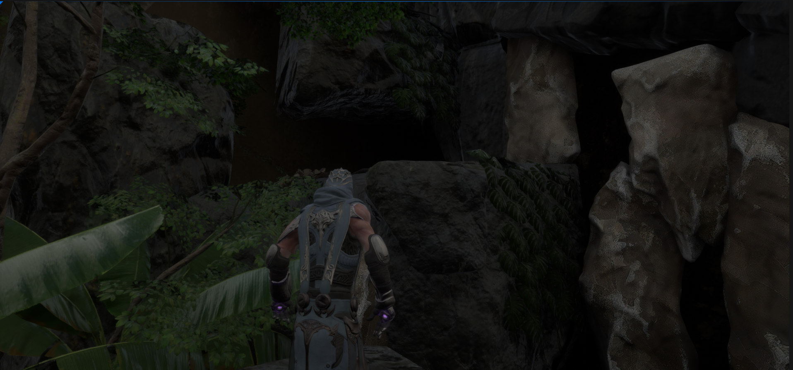|
|:---:|:---:|
 
|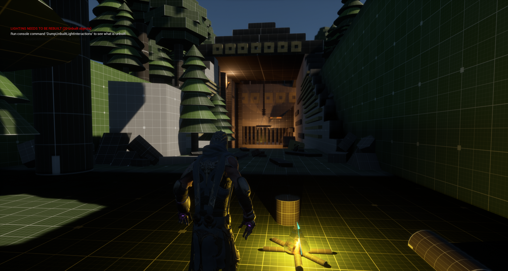 | 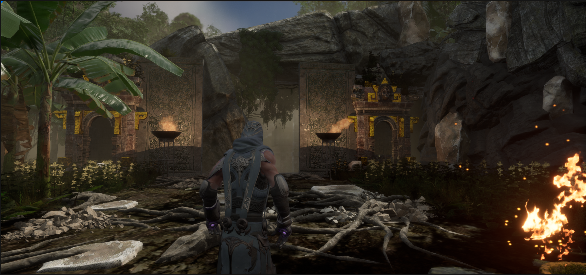|
|:---:|:---:|

|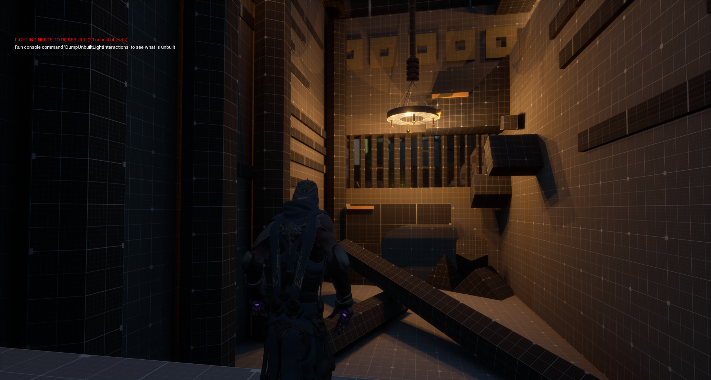 | 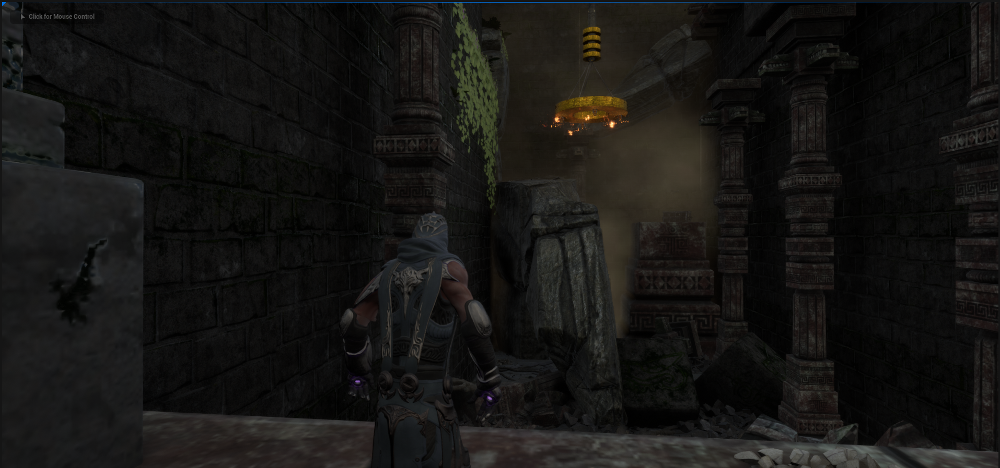|
|:---:|:---:|

|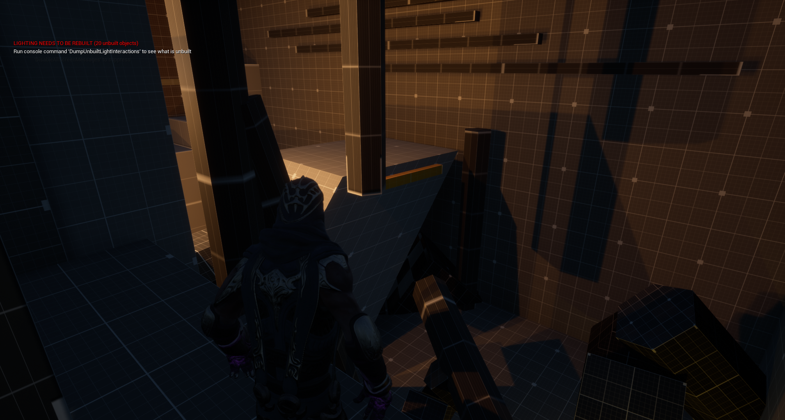 | 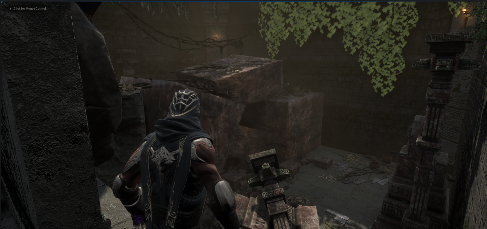|
|:---:|:---:|

|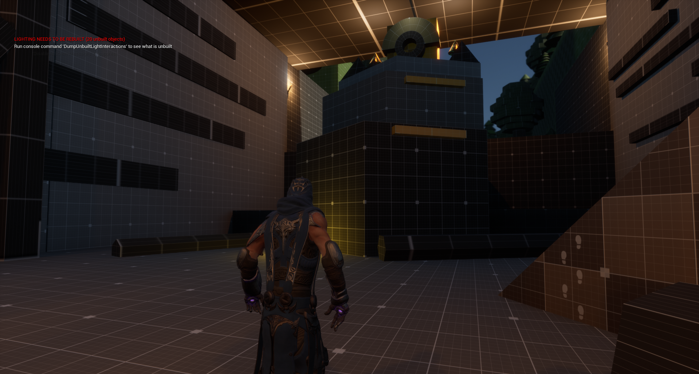 | 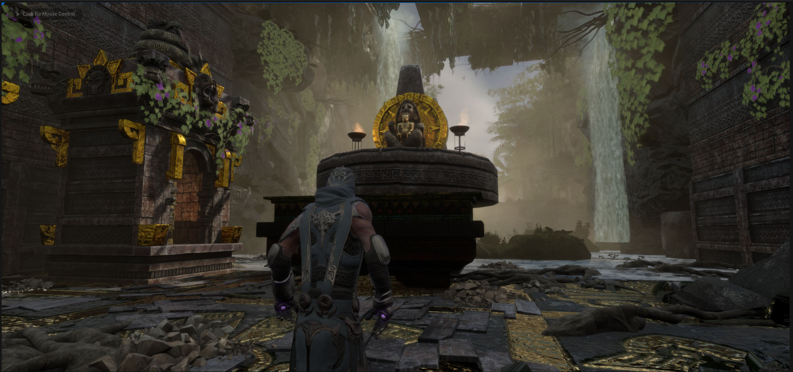|
|:---:|:---:|
 
|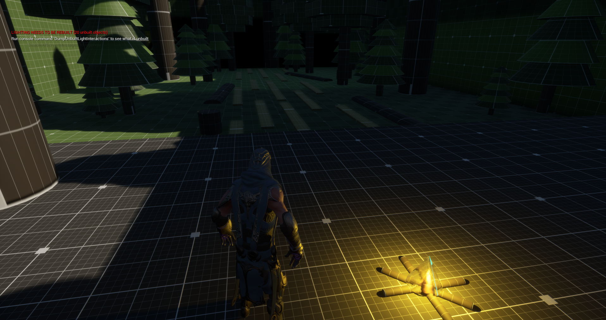 | 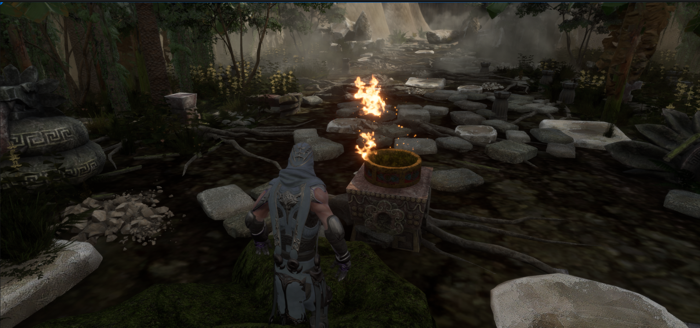|
|:---:|:---:|

## Stack-o-Bot mini Projects:
### Jetpack Jump Puzzle Mini-Game

| | |
|:---:|:---:|
|Technical Walkthrough|Gameplay Walkthrough|

 ### Game Mechanic
 
|
|:---:|
|Magnetic Box Toy|
 
# Thanks for stopping by!
  
  

    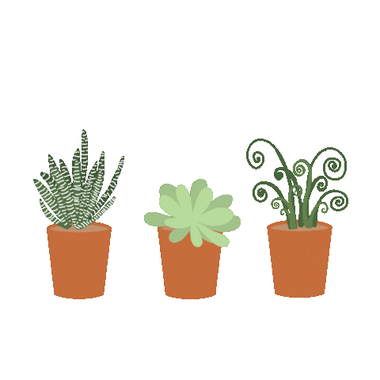
  

